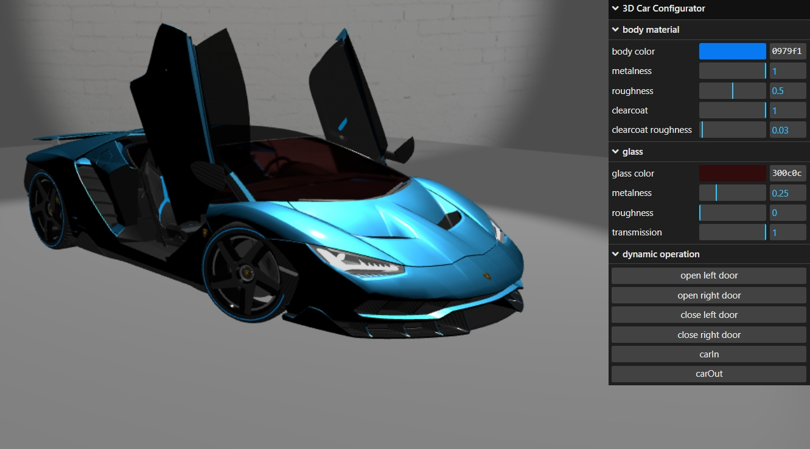

## An immersive virtual experience showcasing automotive showrooms.

<p align="center">
  <kbd>
</img>
  </kbd>
</p>

# Loading Project

Execute the following command in the terminal to install dependencies:

```
npm i
```

Run the following command to start the project:

```
npm run dev
```

# Package the Project

```
npm run build
```

# Project Deployment

Install the following zero-configuration command-line HTTP server:

```
npm install http-server -g
```

Start the server:

```
http-server
```


